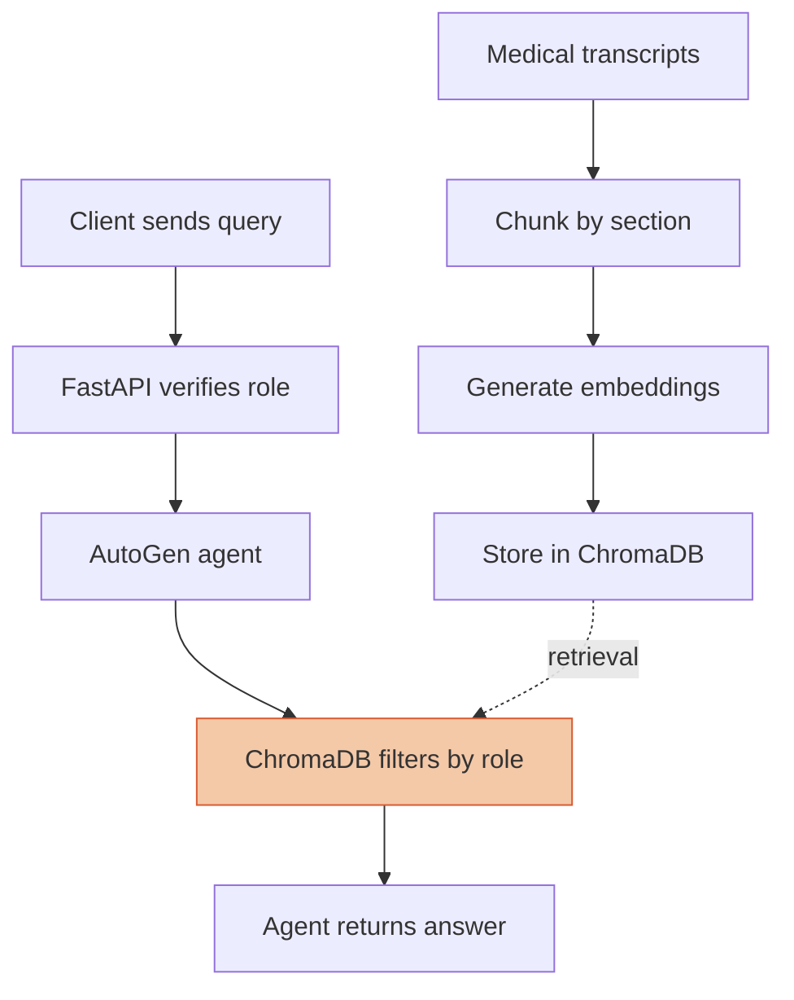

# Role-Based Medical Records AI System


An AI assistant for querying medical records that answers different users differently depending on who they are — a doctor can see everything, a patient can only see their own file, and a pharmacist can only see prescriptions. Ask it a question in plain English and it retrieves and summarizes the relevant medical record on its own.

Built with a multi-agent LLM (**AutoGen**) backed by a vector database (**ChromaDB**), exposed as a **FastAPI** REST API, containerized with **Docker**, and deployed to **Azure Container Apps**.

**Data flow:** transcripts are chunked by section (summary / diagnosis / prescription) → embedded and stored in ChromaDB with metadata (`patient_id`, `section`) → a client sends a query with a Bearer token → FastAPI verifies the role and injects it into the agent's context → the AutoGen agent calls the role-scoped retrieval tool → ChromaDB filters results by metadata before they ever reach the LLM → the agent formats and returns the answer.


---

## Why database-layer access control?

Most LLM-based access control relies on the model "remembering" a rule in its system prompt — for example, "only show patients their own records." That's fragile: a cleverly worded request, a long conversation, or a model slip-up can leak data the LLM was merely *asked* not to share.

This system instead enforces access boundaries where the data is actually retrieved:

```python
# Patient role — physically cannot retrieve another patient's records
results = collection.query(
    query_embeddings=[embedding],
    where={"patient_id": patient_id},  # enforced in the database query itself
    n_results=n
)
```

The LLM never decides *who the user is* — that's resolved upstream by the API layer and injected into the agent's context. The LLM only decides *what to do* with an already-verified role.

---

## Architecture



**Roles and their retrieval scope:**

| Role | Tool | Access scope |
|---|---|---|
| Doctor | `query_all_records` | All patients, all record sections |
| Patient | `query_patient_records` | Own records only (`patient_id` filter) |
| Pharmacist | `query_prescriptions_only` | Prescriptions only, across all patients (`section` filter) |

**Roles and their retrieval scope:**

| Role | Tool | Access scope |
|---|---|---|
| Doctor | query_all_records | All patients, all record sections |
| Patient | query_patient_records | Own records only (patient_id filter) |
| Pharmacist | query_prescriptions_only | Prescriptions only, across all patients (section filter) |

---

## Tech stack

- **AutoGen** (autogen-agentchat, autogen-ext) — multi-agent orchestration
- **ChromaDB** — vector database for semantic retrieval with metadata filtering
- **sentence-transformers** — text embedding (all-MiniLM-L6-v2)
- **Groq** (openai/gpt-oss-120b) — LLM inference via OpenAI-compatible API
- **FastAPI** — REST API layer, handles auth and request routing
- **Docker** — containerization, built for linux/amd64 for cloud compatibility
- **Azure Container Apps** — cloud deployment target

---

## Running locally

### 1. Install dependencies

```bash
pip install -r requirements.txt
```

### 2. Set up environment variables

```bash
cp .env.example .env
```
Then edit .env and add your Groq API key.

### 3. Start a persistent ChromaDB instance

```bash
docker run -d -p 8000:8000 -v "$(pwd)/chroma-data:/chroma/chroma" chromadb/chroma:latest
```

### 4. Run the API

```bash
uvicorn main:app --reload --port 8000
```

Interactive API docs: http://localhost:8000/docs

### 5. Test it

```bash
curl -X POST http://localhost:8000/query -H "Authorization: Bearer key-doctor-001" -H "Content-Type: application/json" -d "{\"message\": \"Tell me about patient P001\"}"
```

---

## Deployed to Azure Container Apps

The application layer is containerized and deployed to Azure Container Apps, navigating several subscription-level constraints along the way (region deployment policies, resource provider registration, ACR Tasks restrictions on student subscriptions, and cross-architecture image builds for arm64 to amd64).

**Known limitation:** the persistent ChromaDB instance currently runs locally rather than as a cloud-hosted service, so the deployed API endpoint requires the vector store to be reachable from the cloud environment to serve live queries. Cloud-hosting the vector store is the natural next step toward a fully cloud-native deployment.

---

## Security notes

- Access control is enforced at the ChromaDB query layer via where filters, not by LLM instruction-following
- API authentication verifies role identity before any message reaches the agent (auth.py); the LLM never sees or trusts a self-reported role
- Secrets are passed via environment variables at runtime, never baked into the Docker image